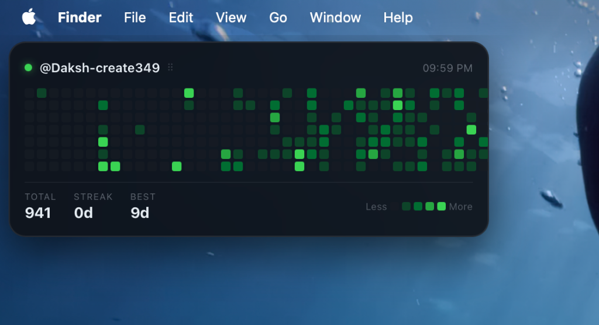

# GitHub Contribution Widget for macOS

~ Made By Daksh Ranjan Srivastava



A lightweight, battery-optimized desktop widget that renders your GitHub contribution heatmap directly on your macOS wallpaper. This widget runs inside Übersicht, a lightweight runtime for desktop widgets, meaning it does not require Xcode or complex compilation, and has negligible impact on system resources and battery life.

## Features

- **Draggable Interface**: Click and hold the widget header to drag and position the widget anywhere on your desktop.
- **Position Persistence**: The widget coordinates automatically save and persist across system restarts and widget reloads.
- **Battery and CPU Optimized**: Leverages requestAnimationFrame for smooth 60fps dragging, uses React useMemo to prevent unnecessary recomputations, and implements a throttled DOM manipulation method that bypasses React rendering entirely during drag operations.
- **Low Network Overhead**: Fetches data only once every 4 hours using a fast public API.
- **Classic Styling**: Dark theme acrylic look with the traditional GitHub emerald green contribution levels.
- **Detailed Statistics**: Displays your total contributions for the year, your current daily contribution streak, and your best daily streak.

---

## Installation Steps

Follow these steps to download, install, and run the widget on your Mac.

### Step 1: Run the installer
Open your Terminal, navigate to the project directory, and run the installation script:

```bash
bash install.sh
```

This script will:
1. Automatically download the latest compatible version of Übersicht (approx. 6 MB).
2. Install the application into your `/Applications` directory.
3. Install the GitHub Contribution Widget folder into the Übersicht widgets directory.
4. Launch Übersicht.

### Step 2: Configure your GitHub username
1. Open the widget file located in the workspace:
   `github-contribution.widget/index.jsx`
2. Locate the configuration block at the top of the file:
   ```javascript
   // ── CONFIG ────────────────────────────────────────────────────
   const GITHUB_USERNAME = "Daksh-create349";   // <- change this to your username
   const DEFAULT_X = 20;          // starting X (pixels from left)
   const DEFAULT_Y = 20;          // starting Y (pixels from top)
   // ─────────────────────────────────────────────────────────────
   ```
3. Replace the placeholder value with your actual GitHub username.
4. Save the file.

### Step 3: Refresh the widget
1. Look at your macOS menu bar at the top-right of your screen.
2. Click the Übersicht icon (which looks like a layout grid or three horizontal blocks).
3. Select **Refresh All Widgets** from the dropdown menu.
4. The widget will reload and render your GitHub contribution graph.

---

## Widget Management

### How to move the widget
- Hover your mouse over the widget header (the top bar displaying `@username` and the drag handles `⠿`).
- Click, hold, and drag the widget to your desired position on the screen.
- Release the mouse button. The widget will lock in place, and its coordinates will be saved.

### How to turn the widget off
- Click the **Übersicht** icon in the macOS menu bar.
- Click **Quit** to close the application and hide all widgets.
- Alternatively, if you want to keep Übersicht running but hide only this widget, click the **Übersicht** menu bar icon, navigate to **Widgets**, and uncheck **github-contribution.widget**.

### How to turn the widget on
- Open Spotlight Search (`Cmd` + `Space`), type `Uebersicht`, and press `Enter`.
- Alternatively, run `open /Applications/Übersicht.app` in your Terminal.

---

## Developer and Customization Details

The widget code is located in:
`github-contribution.widget/index.jsx`

You can customize the following variables in the source code:
- **`refreshFrequency`**: Determines how often the widget calls the GitHub API. By default, this is set to 4 hours to maximize battery savings.
- **`COLORS`**: An array of 5 color values representing contribution levels 0 to 4. You can edit these hex codes to match your wallpaper theme.
- **`CELL_SIZE` / `CELL_GAP`**: Adjust the grid size and cell spacing at the bottom of the style definitions.
